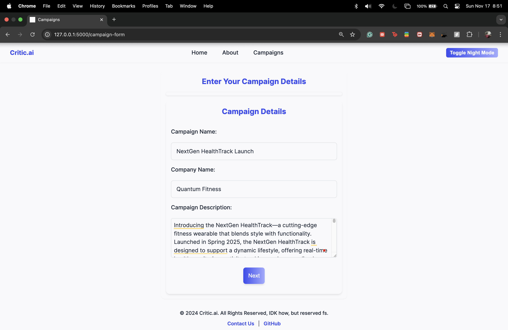

# Critic.ai

## Overview
Critic.ai is a sophisticated marketing campaign analysis tool designed to simulate and critique marketing campaigns using AI-driven insights. The application leverages advanced AI models to provide demographic-specific feedback, making it an invaluable asset for small-scale agencies and individual marketers seeking to optimize their marketing strategies and enhance campaign effectiveness.

## Features
- **Demographic-Specific Analysis**: Tailors feedback based on different demographic profiles to provide targeted insights into the potential reception of marketing campaigns.
- **Comprehensive Feedback**: Combines the capabilities of various AI agents to critique different aspects of a campaign, from visual appeal to content relevance.
- **Intuitive User Interface**: Features a user-friendly interface that makes it easy for users to input campaign details and receive structured feedback.
- **Scalable Architecture**: Built to handle multiple users and sessions simultaneously, ensuring a responsive experience across various devices.

## Technology Stack
- **Frontend**: HTML, CSS, JavaScript
- **Backend**: Flask (Python)
- **AI Models**: Integrated with CrewAI for advanced data processing and analysis.
- **Database**: (Optional - describe any database used like MySQL, PostgreSQL, etc.)
- **Deployment**: Docker, (and any cloud platforms used, like AWS, GCP, etc.)

## Getting Started

### Prerequisites
- Python 3.11 or higher
- Flask
- crewai

...

## Usage
After starting the application, navigate to `http://localhost:5000` in your web browser to start using Critic.ai. Follow the on-screen instructions to input your marketing campaign details and receive feedback.

...
For more such images please head to the images folder in this GitHub repo.

## Contact
Varun Deliwala - [varundeliwala@gmail.com](mailto:varundeliwala@gmail.com)

Project Link: [https://github.com/varun1352/Critic.ai](https://github.com/varun1352/Critic.ai)
